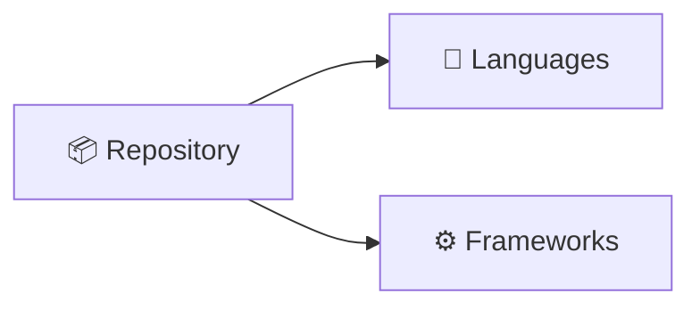

# 🏗️ RepoArchitectAgent

**Automatically analyze GitHub repositories, generate architecture diagrams, propose CI/CD pipelines, and open pull requests.**

[](LICENSE)
[](web/)
[](api/)
[](api/)
[]()

> **AI-powered repository analysis tool** that generates architecture diagrams, CI/CD pipelines, and AI summaries in seconds.

## ✨ Core Features

- 🔍 **Repository Analysis** - Detect 10+ languages, 15+ frameworks, dependencies, API endpoints  
- 📊 **Architecture Diagrams** - Auto-generate Mermaid diagrams with tech stack visualization
- 🤖 **AI Summaries** - Oumi API (primary) + OpenAI (fallback) for intelligent insights
- ⚙️ **Auto CI/CD** - Smart GitHub Actions workflows tailored to detected tech stack
- 📤 **PR Creation** - One-click pull requests with generated CI pipelines  
- 🎨 **Web UI** - Beautiful Next.js 14 frontend with real-time results
- 🔗 **Kestra Integration** - Production-grade 8-step orchestration pipeline
- 📝 **CodeRabbit Integration** - 8 custom AI-powered code review rules
- ✅ **Error Tolerant** - Graceful degradation; optional features don't block pipeline

## 🎯 Integrated Sponsor Tools

| Tool | Purpose | Status |
|------|---------|--------|
| **Kestra** | Workflow orchestration | ✅ Integrated ([docs/KESTRA.md](docs/KESTRA.md)) |
| **Oumi** | LLM summaries | ✅ Integrated ([docs/OUMI_PROMPTS.md](docs/OUMI_PROMPTS.md)) |
| **CodeRabbit** | Code review | ✅ Integrated ([docs/CODERABBIT.md](docs/CODERABBIT.md)) |
| **Vercel** | Next.js deployment | ✅ Configured |

## 📦 Tech Stack

| Component | Technology | Purpose |
|-----------|-----------|---------|
| **Frontend** | Next.js 14.2 + React 18.2 + TypeScript | Web UI |
| **Backend Analysis** | Python 3.11 | Repository parsing |
| **Scripting** | Node.js 18 + JavaScript | Diagram & CI generation |
| **Diagrams** | Mermaid 10.9 | Visualization |
| **LLM** | Oumi + OpenAI | AI summaries |
| **Orchestration** | Kestra | Production pipeline |
| **Deployment** | Vercel | Hosting |
| **CI/CD** | GitHub Actions | Automation |

## 🚀 Quick Start

### Prerequisites

- **Python 3.11+** - For repository analysis
- **Node.js 18+** - For web server and scripts
- **Git 2.0+** - For cloning repositories
- **npm 9+** - For package management

### 1️⃣ Install Dependencies

```bash
# Install Node.js dependencies
cd web
npm install --legacy-peer-deps

# Return to root
cd ..
```

### 2️⃣ Configure Environment

```bash
# Create .env.local in web/ directory
cd web
cp ../.env.example .env.local

# Edit .env.local and add your API keys (optional)
# GITHUB_TOKEN=ghp_...
# OUMI_API_KEY=oumi_sk_...
# OPENAI_API_KEY=sk-proj-...

cd ..
```

### 3️⃣ Run Development Server

```bash
# From root directory
cd web
npm run dev

# Open http://localhost:3000
```

### 4️⃣ Test the Pipeline

```bash
# Analyze a local repository
python api/analyze_repo.py "."

# Or analyze a local directory
python api/analyze_repo.py "web"

# Generate diagram
node api/generate_mermaid.js runs/latest/repo_shape.json runs/latest

# Generate CI template
node api/generate_ci.js runs/latest/repo_shape.json runs/latest

# View results
cat runs/latest/diagram.mmd
cat runs/latest/ci-generated.yml
```

## 📚 Documentation

| Document | Purpose |
|----------|---------|
| [README.md](README.md) | This file - project overview |
| [docs/QUICK_START.md](docs/SETUP_AND_REVIEW.md) | Token setup & problem coverage |
| [docs/DEMO.md](docs/DEMO.md) | 2-minute walkthrough with examples |
| [docs/GITHUB_ACTIONS_GUIDE.md](docs/GITHUB_ACTIONS_GUIDE.md) | Automated workflow setup |
| [docs/STEP_13_DEMO_GUIDE.md](docs/STEP_13_DEMO_GUIDE.md) | Demo runs & artifact collection |
| [docs/STEP_15_INTEGRATION.md](docs/STEP_15_INTEGRATION.md) | Component integration testing |
| [docs/VERCEL.md](docs/VERCEL.md) | Vercel deployment guide |
| [docs/KESTRA.md](docs/KESTRA.md) | Kestra orchestration setup |
| [docs/OUMI_PROMPTS.md](docs/OUMI_PROMPTS.md) | LLM configuration |
| [docs/CODERABBIT.md](docs/CODERABBIT.md) | Code review configuration |
| [TESTING_GUIDE.txt](TESTING_GUIDE.txt) | Complete team testing checklist |

## 🔧 Usage Examples

### Via Web UI (Easiest)
```bash
npm run dev  # http://localhost:3000
# Enter repository URL → Click "Analyze" → View results
```

### Via CLI (Direct)
```bash
# Analyze current directory
python api/analyze_repo.py "."

# Analyze web subdirectory
python api/analyze_repo.py "web"

# View generated artifacts
ls -la runs/latest/
```

### Via Demo Script
```bash
# Run full demo on 3 sample repos
bash scripts/run_demo.sh

# View results
ls -la demo/runs/
```

## 📊 What Gets Generated

For each analyzed repository:

```
runs/latest/
├── repo_shape.json          # Complete structure analysis
├── diagram.mmd              # Mermaid architecture diagram
├── ci-generated.yml         # GitHub Actions workflow
├── summary.json             # AI insights (optional, needs API key)
└── README.md                # Combined report
```

### Sample Output

**repo_shape.json**: Metadata about languages, frameworks, dependencies
```json
{
  "languages": ["JavaScript", "Python", "TypeScript"],
  "frameworks": ["React", "Next.js", "Node.js"],
  "api_endpoints": ["/api/analyze", "/api/generate"],
  "file_count": 95
}
```

**diagram.mmd**: Visual architecture


**ci-generated.yml**: Ready-to-use GitHub Actions workflow
```yaml
name: CI Pipeline
on: [push, pull_request]
jobs:
  test:
    runs-on: ubuntu-latest
    # ...
```

## 🔑 Environment Variables (Optional)

All API keys are **optional**. The system works without them:

| Variable | Service | Purpose | Required? |
|----------|---------|---------|-----------|
| `GITHUB_TOKEN` | GitHub | PR creation | For PR feature |
| `OUMI_API_KEY` | Oumi.ai | AI summaries (faster, cheaper) | Optional ⭐ |
| `OPENAI_API_KEY` | OpenAI | AI summaries (fallback) | Optional ⭐ |
| `VERCEL_TOKEN` | Vercel | Deployment automation | Optional |

**⭐ API Keys are completely optional** - core analysis works without any API keys.

Set in `web/.env.local`:
```bash
GITHUB_TOKEN=ghp_XXXX...
OUMI_API_KEY=oumi_sk_XXXX...
OPENAI_API_KEY=sk-proj-XXXX...
```

## 📁 Project Structure

```
├── api/                              # Backend scripts
│   ├── analyze_repo.py              # Python: Repository analysis
│   ├── generate_mermaid.js          # Node.js: Diagram generation
│   ├── generate_ci.js               # Node.js: CI template
│   ├── generate_summary.js          # Node.js: AI summaries
│   └── open_pr.js                   # Node.js: PR creation
│
├── web/                              # Next.js Frontend
│   ├── pages/index.tsx              # Main UI
│   ├── pages/api/analyze.ts         # API endpoint
│   ├── components/                  # React components
│   ├── styles/                      # Tailwind CSS
│   └── package.json                 # Dependencies
│
├── scripts/                          # Utility scripts
│   ├── run_demo.sh                  # Demo runner
│   └── test_integration.sh          # Integration tests
│
├── kestra/                           # Orchestration
│   └── blueprint_repo_analysis.yml  # 8-step pipeline
│
├── .github/                          # GitHub Actions
│   └── workflows/                   # CI/CD workflows
│
├── docs/                             # Documentation
│   ├── README.md                    # Main docs
│   ├── DEMO.md                      # Demo guide
│   ├── GITHUB_ACTIONS_GUIDE.md      # Workflows guide
│   └── ...more guides
│
└── README.md                         # This file
```

## 🧪 Testing

### Run Integration Tests
```bash
bash scripts/test_integration.sh
```

### Run Demo
```bash
bash scripts/run_demo.sh
```

### Manual Testing
```bash
# Test analysis
python api/analyze_repo.py "."

# Test diagram generation
node api/generate_mermaid.js runs/latest/repo_shape.json runs/latest

# Test CI generation  
node api/generate_ci.js runs/latest/repo_shape.json runs/latest

# View results
cat runs/latest/diagram.mmd
cat runs/latest/ci-generated.yml
```

See [TESTING_GUIDE.txt](TESTING_GUIDE.txt) for comprehensive team testing checklist.

## 🚢 Deployment

### Local Development
```bash
cd web
npm run dev
```

### Vercel Production
1. Push to `main` branch
2. Vercel auto-deploys
3. Visit your deployment URL

See [docs/VERCEL.md](docs/VERCEL.md) for detailed setup.

## 🤝 Contributing

### Branch Strategy
- `main` - Production-ready code
- `development` - Active development
- `feature/*` - Feature branches

### Before Submitting PR
1. Run integration tests: `bash scripts/test_integration.sh`
2. Test on sample repos: `bash scripts/run_demo.sh`
3. Check code review: Ensure CodeRabbit passes

## 📝 License

MIT License - see [LICENSE](LICENSE) file

## 🙌 Acknowledgments

**Sponsor Tools**:
- 🏗️ Kestra for orchestration
- 🤖 Oumi for LLM API
- 🦚 CodeRabbit for code review  
- ⚡ Vercel for Next.js hosting

## 📞 Support

- **Questions?** Check [docs/](docs/) folder
- **Issues?** See [TESTING_GUIDE.txt](TESTING_GUIDE.txt) troubleshooting
- **Team Testing?** Share [TESTING_GUIDE.txt](TESTING_GUIDE.txt) with your team

## 🔍 Features Breakdown

### ✅ What Works Without API Keys
- Repository analysis (languages, frameworks, dependencies)
- Architecture diagram generation
- CI/CD template creation
- Web UI and visualization
- GitHub Actions workflow generation

### ⭐ What Requires API Keys (Optional)
- AI summaries via Oumi/OpenAI
- Automatic PR creation (needs GitHub token)
- Vercel deployment automation

## 🎓 Learning Resources

- [Repository Analysis](api/analyze_repo.py) - Python language detection
- [Diagram Generation](api/generate_mermaid.js) - Mermaid syntax
- [CI Templates](api/generate_ci.js) - GitHub Actions best practices
- [Web UI](web/pages/index.tsx) - Next.js patterns
- [Orchestration](kestra/blueprint_repo_analysis.yml) - Workflow design

---

**RepoArchitectAgent** - Making repository analysis intelligent and effortless. ✨

Last updated: December 2025


Open http://localhost:3000 in your browser.

### 3. Analyze a Repository

1. Paste a GitHub repo URL: `https://github.com/lodash/lodash`
2. Click **"Analyze Repository"**
3. View:
   - Repository structure (JSON)
   - Architecture diagram (Mermaid)
   - AI summary (if API key set)

## 📖 Documentation

| Document | Purpose |
|----------|---------|
| [README.md](README.md) | **← You are here** - Project overview & setup |
| [PRD.md](docs/PRD.md) | Product requirements & design decisions |
| [DEMO.md](docs/DEMO.md) | 2-minute demo script with step-by-step instructions |
| [KESTRA.md](docs/KESTRA.md) | Kestra workflow orchestration guide |
| [OUMI_PROMPTS.md](docs/OUMI_PROMPTS.md) | LLM integration, prompts, and examples |
| [CODERABBIT.md](docs/CODERABBIT.md) | CodeRabbit setup and AI code review |

## 🏗️ Project Structure

```
RepoArchitectAgent/
├── web/                                    # Next.js frontend
│   ├── pages/
│   │   ├── index.tsx                       # Main UI (form + results)
│   │   └── api/
│   │       ├── analyze.ts                  # Repository analysis endpoint
│   │       └── generate-ci.ts              # CI generation endpoint
│   ├── components/
│   │   └── MermaidViewer.tsx               # Diagram viewer
│   ├── styles/
│   │   └── globals.css                     # Tailwind CSS
│   └── package.json                        # Dependencies
│
├── api/                                    # Python & Node.js scripts
│   ├── analyze_repo.py                     # Repo analysis (languages, frameworks, deps)
│   ├── generate_mermaid.js                 # Mermaid diagram generation
│   ├── generate_ci.js                      # GitHub Actions workflow generation
│   ├── generate_summary.js                 # LLM summary generation (Oumi/OpenAI)
│   ├── open_pr.js                          # PR creation (git + GitHub API)
│   └── helpers/
│       └── repo_parsers.py                 # Utility functions
│
├── kestra/
│   └── blueprint_repo_analysis.yml         # Complete orchestration pipeline
│
├── .github/
│   └── workflows/
│       └── deploy.yml                      # Vercel deployment (optional)
│
├── .coderabbit.yml                         # CodeRabbit AI review config
├── docs/
│   ├── PRD.md                              # Product requirements
│   ├── DEMO.md                             # Demo instructions
│   ├── KESTRA.md                           # Kestra guide
│   ├── OUMI_PROMPTS.md                     # LLM guide
│   └── CODERABBIT.md                       # Code review guide
└── runs/                                   # Generated artifacts
    └── latest/
        ├── repo_shape.json                 # Repository analysis
        ├── diagram.mmd                     # Mermaid diagram
        ├── ci-generated.yml                # GitHub Actions workflow
        ├── summary.json                    # LLM summary (optional)
        └── prompts.md                      # Prompt audit trail
```

## 🔧 Setup & Configuration

### Prerequisites

- **Node.js** 18+ (for Next.js and Node scripts)
- **Python** 3.9+ (for repo analysis)
- **Git** (for repository cloning)
- **GitHub Account** (optional, for PR creation)

### Environment Variables

```bash
# GitHub API (required for PR creation)
export GITHUB_TOKEN=ghp_xxxxxxxxxxxxx

# LLM APIs (optional, for AI summaries)
export OUMI_API_KEY=oumi_sk_xxxxxxxxxxxxx
export OPENAI_API_KEY=sk-proj-xxxxxxxxxxxxx

# Kestra (optional, for orchestration)
export KESTRA_URL=http://localhost:8080
```

### Local Development

```bash
# 1. Install dependencies
cd web
npm install
cd ..

# 2. Start Next.js dev server
cd web
npm run dev

# 3. Open http://localhost:3000
```

### Command-Line Usage

```bash
# Analyze a repository
python api/analyze_repo.py https://github.com/owner/repo runs/latest

# Generate Mermaid diagram
node api/generate_mermaid.js runs/latest/repo_shape.json runs/latest

# Generate CI pipeline
node api/generate_ci.js runs/latest/repo_shape.json runs/latest

# Generate AI summary (requires OUMI_API_KEY or OPENAI_API_KEY)
node api/generate_summary.js runs/latest/repo_shape.json runs/latest

# Open PR (requires GITHUB_TOKEN and git setup)
node api/open_pr.js https://github.com/owner/repo runs/latest/ci-generated.yml
```

## 📊 Pipeline Overview

```
User Input (GitHub URL)
    ↓
[1] Clone Repository (shallow, --depth 1)
    ↓
[2] Analyze Structure
    ├─→ Detect languages
    ├─→ Find frameworks
    ├─→ Parse dependencies
    ├─→ Extract API endpoints
    └─→ Output: repo_shape.json
    ↓
[3] Generate Mermaid Diagram ─→ diagram.mmd
    ↓
[4] Generate CI Pipeline ─────→ ci-generated.yml
    ├─→ Node.js template
    ├─→ Python template
    ├─→ Go template
    ├─→ Rust template
    └─→ Smart language detection
    ↓
[5] Generate LLM Summary ─────→ summary.json (optional)
    ├─→ Try Oumi API
    ├─→ Fallback to OpenAI
    └─→ 3-sentence summary + 5 hotspots + 3-step checklist
    ↓
[6] Open Pull Request ────────→ pr_info.json (optional)
    └─→ Create branch, commit, push, open PR
    ↓
[7] Display Results in UI
    ├─→ Repository shape (JSON)
    ├─→ Architecture diagram (Mermaid)
    ├─→ AI summary (markdown)
    └─→ PR link
```

## 🎬 Quick Demo

**See [DEMO.md](docs/DEMO.md) for detailed 2-minute walkthrough.**

### TL;DR

1. **Start server**: `cd web && npm run dev`
2. **Open**: http://localhost:3000
3. **Paste repo**: `https://github.com/vercel/next.js`
4. **Click analyze**
5. **View diagram** + structure + summary
6. **Optional**: Click "Generate CI & Open PR" (requires GITHUB_TOKEN)

## 📈 Architecture Decisions

### Why Shallow Clone?
- Faster analysis (no full history download)
- Reduces bandwidth by 90%+
- Typical clone: 2-3 seconds vs. 30+ seconds

### Why Mermaid?
- Lightweight, no external dependencies
- Renders in browser natively
- Clean, professional diagrams

### Why Kestra?
- Production-ready orchestration
- Visual workflow designer
- Scalable to thousands of repos

### Why Multiple LLMs?
- **Oumi**: Cheaper, faster for MVP
- **OpenAI**: Fallback, more reliable

### Why Error Tolerance?
- LLM summaries are optional (nice-to-have)
- PR creation is optional (requires credentials)
- Core pipeline (analyze → diagram → CI) always succeeds

## 🚀 Deployment

### Vercel (Next.js Frontend)

```bash
# 1. Push to GitHub
git push origin main

# 2. Import in Vercel
# - Select repository
# - Set root directory: web
# - Deploy

# 3. Set environment variables in Vercel
GITHUB_TOKEN=ghp_xxxxx
OUMI_API_KEY=oumi_sk_xxxxx
OPENAI_API_KEY=sk-proj-xxxxx
```

Vercel URL will be: `https://repoarchitectagent.vercel.app`

### Kestra (Workflow Orchestration)

```bash
# 1. Start Kestra
docker run -p 8080:8080 kestra/kestra:latest

# 2. Import blueprint
kestra flow create --file kestra/blueprint_repo_analysis.yml

# 3. Execute
kestra execute flow repo_architect_agent repoarchitectagent \
  --inputs repo_url="https://github.com/owner/repo"
```

Kestra UI: http://localhost:8080

## 🧪 Testing

### Manual Testing

```bash
# Test repo analysis
python api/analyze_repo.py https://github.com/lodash/lodash runs/test-lodash

# Test mermaid generation
node api/generate_mermaid.js runs/test-lodash/repo_shape.json runs/test-lodash

# Test CI generation
node api/generate_ci.js runs/test-lodash/repo_shape.json runs/test-lodash

# View results
cat runs/test-lodash/repo_shape.json
cat runs/test-lodash/diagram.mmd
cat runs/test-lodash/ci-generated.yml
```

### Testing with Real Repos

Recommended test repositories:
- **Node.js**: https://github.com/lodash/lodash
- **Python**: https://github.com/pallets/flask
- **Full-stack**: https://github.com/vercel/next.js

## 🐛 Troubleshooting

### `python: command not found`
- Install Python 3.9+: https://www.python.org/downloads/
- Add to PATH
- Verify: `python --version`

### `npm: command not found`
- Install Node.js 18+: https://nodejs.org/
- Verify: `npm --version`

### `git clone --depth 1` fails
- Check internet connectivity
- Verify repo URL is public
- Try `git clone --depth 1 https://github.com/owner/repo.git`

### Mermaid diagram not rendering
- Check syntax in `runs/latest/diagram.mmd`
- Verify Mermaid version in `web/package.json`
- Try opening in https://mermaid.live

### LLM summary not generated
- Set `OUMI_API_KEY` or `OPENAI_API_KEY`
- Verify API key is valid
- Check network connectivity
- Summary generation is optional; other features continue

### PR not created
- Set `GITHUB_TOKEN` with `repo` scope
- Install GitHub CLI: https://cli.github.com/
- Or use REST API method (built-in)
- PR creation is optional; other features continue

## 📚 Learning Resources

### Kestra
- [Kestra Documentation](https://kestra.io/docs)
- [GitHub Repository](https://github.com/kestra-io/kestra)

### Oumi
- [Oumi Documentation](https://www.oumi.ai/)
- [API Guide](https://docs.oumi.ai/api)

### CodeRabbit
- [CodeRabbit Docs](https://docs.coderabbit.ai/)
- [GitHub App](https://github.com/apps/coderabbit)

### Next.js
- [Next.js Documentation](https://nextjs.org/docs)
- [TypeScript Guide](https://nextjs.org/docs/advanced-features/using-typescript)

## 🤝 Contributing

Pull requests are welcome! Please:

1. Fork the repository
2. Create a feature branch: `git checkout -b feature/amazing-feature`
3. Commit changes: `git commit -m 'Add amazing feature'`
4. Push to branch: `git push origin feature/amazing-feature`
5. Open a Pull Request

## 📄 License

This project is licensed under the MIT License - see the [LICENSE](LICENSE) file for details.

## 🙏 Acknowledgments

- **Vercel** - Next.js framework
- **Kestra** - Workflow orchestration
- **Oumi** - LLM API
- **OpenAI** - Fallback LLM provider
- **CodeRabbit** - AI code review
- **GitHub** - Repository hosting & API

## 📞 Support

- **Issues**: [GitHub Issues](../../issues)
- **Discussions**: [GitHub Discussions](../../discussions)
- **Documentation**: [docs/](docs/)

---

**Made with ❤️ for the hackathon**
