# RepoArchitectAgent Demo Results Guide

This directory demonstrates the output of RepoArchitectAgent on real repositories.

## Quick Start

### Run a full demo
```bash
bash scripts/run_demo.sh
```

This will:
1. Analyze 3 sample repositories
2. Generate diagrams for each
3. Create AI summaries
4. Generate CI/CD templates
5. Collect all artifacts in `demo/runs/`

### What You'll See

```
demo/
├── runs/
│   └── TIMESTAMP/
│       ├── repo_name_1/
│       │   ├── analysis.json      (Full structure analysis)
│       │   ├── diagram.mmd        (Architecture diagram)
│       │   ├── summary.json       (AI insights)
│       │   ├── ci_template.yml    (Generated CI workflow)
│       │   └── README.md          (Combined report)
│       ├── repo_name_2/
│       │   └── [same structure]
│       └── repo_name_3/
│           └── [same structure]
└── samples/
    ├── sample_analysis.json       (Example output)
    ├── sample_diagram.mmd         (Example diagram)
    ├── sample_summary.json        (Example summary)
    └── sample_ci.yml              (Example CI template)
```

## Sample Output Files

Below are real examples from actual analyses:

### 1. analysis.json (Structure Analysis)

Shows complete repository structure with:
- **languages**: Detected programming languages with file counts
- **frameworks**: Identified frameworks and libraries
- **dependencies**: Package manager dependencies
- **api_endpoints**: Detected API routes
- **file_structure**: Directory tree overview

Example (excerpt):
```json
{
  "repo_url": "https://github.com/example/repo",
  "analyzed_at": "2025-12-12T10:30:00Z",
  "languages": {
    "JavaScript": 45,
    "TypeScript": 23,
    "Python": 12
  },
  "frameworks": {
    "React": "18.2.0",
    "Next.js": "14.0.0",
    "Node.js": "18+"
  },
  "dependencies": {
    "npm": ["react", "next", "tailwind"],
    "pip": ["requests", "pathlib"]
  },
  "api_endpoints": [
    "GET /api/analyze",
    "POST /api/summarize"
  ],
  "file_structure": "..."
}
```

### 2. diagram.mmd (Mermaid Diagram)

Architecture visualization showing:
- Directory structure
- Language breakdown with emoji icons
- Framework dependencies
- API endpoints
- File statistics

Example:


```mermaid
graph LR
    A[RepoArchitectAgent] --> B[Languages<br/>JS: 45<br/>TS: 23<br/>PY: 12]
    A --> C[Frameworks<br/>React 18<br/>Next.js 14<br/>TailwindCSS]
    A --> D[Dependencies<br/>npm packages<br/>pip modules]
    A --> E[API Routes<br/>GET /api/analyze<br/>POST /api/summarize]
    B --> F[📦 Main]
    B --> G[🔧 Components]
    B --> H[📡 Backend]
```

### 3. summary.json (AI Summary)

AI-powered insights generated via Oumi/OpenAI:
- **summary**: 3-sentence overview of the project
- **hotspots**: Top 5 important files/areas
- **onboarding**: 3-step guide to understanding the repo
- **tech_stack**: Identified stack

Example:
```json
{
  "summary": "This is a full-stack Next.js application for repository analysis. It provides automated insights through AI-powered code review. The architecture includes a Python backend for file parsing and a React frontend for visualization.",
  "hotspots": [
    {
      "file": "api/analyze_repo.py",
      "description": "Core analysis engine with language detection"
    },
    {
      "file": "web/pages/index.tsx",
      "description": "Main UI for input and results display"
    }
  ],
  "onboarding": [
    "Start with README.md for overview",
    "Review api/analyze_repo.py for analysis logic",
    "Explore web/pages/ for UI implementation"
  ],
  "tech_stack": "Next.js (React + TypeScript) + Python backend + Mermaid diagrams"
}
```

### 4. ci_template.yml (Generated CI/CD)

GitHub Actions workflow customized for the repo's tech stack:

Example (Node.js + Python repo):
```yaml
name: CI/CD Pipeline

on:
  push:
    branches: [main]
  pull_request:
    branches: [main]

jobs:
  test:
    runs-on: ubuntu-latest
    steps:
      - uses: actions/checkout@v4
      - uses: actions/setup-node@v4
        with:
          node-version: '18'
      - uses: actions/setup-python@v4
        with:
          python-version: '3.11'
      - run: npm install && npm run test
      - run: python -m pytest
```

## Analyzing Your Own Repository

### Method 1: Command Line
```bash
# Direct analysis
python api/analyze_repo.py "https://github.com/your/repo"

# Or analyze local repo
python api/analyze_repo.py "/path/to/local/repo"
```

### Method 2: Web UI
```bash
cd web
npm run dev
# Open http://localhost:3000
# Enter repo URL and submit
```

### Method 3: GitHub Actions (Automatic)
1. Push code to your repo
2. Go to Actions tab
3. Select "Analyze Repository"
4. Click "Run workflow"
5. Download artifacts when complete

## Sample Repositories to Try

Good test cases for RepoArchitectAgent:

| Repo | Size | Stack | Interest |
|------|------|-------|----------|
| `facebook/react` | Large | TypeScript/JavaScript | Popular framework |
| `torvalds/linux` | Huge | C | Kernel analysis |
| `vuejs/vue` | Medium | TypeScript | Vue.js framework |
| `nodejs/node` | Large | C++/JavaScript | Runtime engine |
| `python/cpython` | Large | Python/C | Python runtime |
| `kubernetes/kubernetes` | Large | Go | Cloud infrastructure |

## Organizing Demo Results

After running demos, organize results:

```bash
# Create results directory
mkdir -p demo/runs/results_2025_12_12

# Copy artifacts
cp demo/runs/TIMESTAMP_*/*/analysis.json demo/runs/results_2025_12_12/
cp demo/runs/TIMESTAMP_*/*/diagram.mmd demo/runs/results_2025_12_12/

# Create index
ls -lah demo/runs/results_2025_12_12/
```

## Troubleshooting Demo Runs

### "Python not found"
```bash
# Install Python 3.11+
# macOS
brew install python@3.11

# Ubuntu/Debian
sudo apt-get install python3.11

# Windows
# Download from python.org
```

### "Node not found"
```bash
# Install Node.js 18+
# macOS
brew install node@18

# Ubuntu/Debian
curl -fsSL https://deb.nodesource.com/setup_18.x | sudo -E bash -
sudo apt-get install -y nodejs

# Windows
# Download from nodejs.org
```

### "Network timeout"
```bash
# Try again with shorter timeout
timeout 60 python api/analyze_repo.py "https://github.com/your/repo"

# Or analyze local repo instead
python api/analyze_repo.py "/path/to/local/repo"
```

### "API key not found"
The demo will still work—summaries just won't be generated. Set:
```bash
export OUMI_API_KEY=oumi_sk_...
export OPENAI_API_KEY=sk-proj-...
```

## Next Steps

After running demos:

1. **Review artifacts** in `demo/runs/`
2. **Check diagrams** in a Mermaid renderer (https://mermaid.live)
3. **Analyze quality** of summaries and insights
4. **Test on your own repo** via web UI
5. **Proceed to Step 14** for integration testing

## More Information

- See [GITHUB_ACTIONS_GUIDE.md](../docs/GITHUB_ACTIONS_GUIDE.md) for automated runs
- See [README.md](../README.md) for full project overview
- See [DEMO.md](../docs/DEMO.md) for feature walkthrough

---

**Next Step**: End-to-end testing (Step 14)
