# 🤖 Cline Integration Guide

Complete guide to using RepoArchitectAgent with Cline AI agent.

---

## What is Cline?

**Cline** is an AI agent framework that enables autonomous task execution and learning. It can:
- ✅ Run bash commands and scripts
- ✅ Execute analysis pipelines
- ✅ Process results and generate insights
- ✅ Handle errors and fallback scenarios
- ✅ Provide interactive assistance

**Website**: https://github.com/cline/cline

---

## Why Cline + RepoArchitectAgent?

### Without Cline (Manual)
```bash
# You run each step manually
python api/analyze_repo.py <repo> <output>
node api/generate_mermaid.js <output>/repo_shape.json <output>
node api/generate_ci.js <output>/repo_shape.json <output>
node api/generate_summary.js <output>/repo_shape.json <output>
# Check results
# Interpret findings
# Create documentation
```

### With Cline (Automated)
```bash
# Cline handles everything
cline run "Analyze <repo> and generate architecture insights"
# Cline coordinates all scripts
# Cline interprets results
# Cline generates documentation
```

**Benefits**:
- ✅ One-command analysis
- ✅ Intelligent error recovery
- ✅ Automatic result interpretation
- ✅ Context-aware insights
- ✅ Batch processing automation
- ✅ Interactive assistance

---

## Installation

### Step 1: Install Cline

```bash
# Option A: Using npm (recommended)
npm install -g cline

# Option B: Using pip
pip install cline

# Option C: From source
git clone https://github.com/cline/cline.git
cd cline
npm install
npm run build
```

### Step 2: Verify Installation

```bash
cline --version
# Output: Cline vX.X.X

cline --help
# Shows available commands
```

### Step 3: Configure Cline (Optional)

Create `~/.cline/config.json`:
```json
{
  "ai_provider": "openai",
  "model": "gpt-4",
  "temperature": 0.7,
  "max_tokens": 4096,
  "timeout": 300,
  "cache_results": true,
  "log_level": "info"
}
```

---

## Usage

### Method 1: Single Repository Analysis

```bash
# Basic usage
./api/run_with_cline.sh run https://github.com/lodash/lodash

# With custom output directory
./api/run_with_cline.sh run https://github.com/lodash/lodash runs/lodash_analysis

# Output
# ================================
# ✓ Repository analyzed
# ✓ Diagram generated
# ✓ CI configuration created
# ✓ Summary generated
# Results saved to: runs/lodash_analysis
```

### Method 2: Batch Processing

Create `repos.txt`:
```
https://github.com/lodash/lodash
https://github.com/pallets/flask
https://github.com/vercel/next.js
https://github.com/golang/go
https://github.com/tokio-rs/tokio
```

Run batch:
```bash
./api/run_with_cline.sh batch repos.txt

# Output
# [1] Analyzing: https://github.com/lodash/lodash
# ✓ Completed
# [2] Analyzing: https://github.com/pallets/flask
# ✓ Completed
# [3] Analyzing: https://github.com/vercel/next.js
# ✓ Completed
# ...
# 
# ================================
# Batch Analysis Summary
# Total: 5
# Successful: 5
# Failed: 0
```

### Method 3: Interactive Mode

```bash
# Start interactive shell
./api/run_with_cline.sh interactive

# Menu
# Options:
#   1) Analyze single repository
#   2) Batch analysis
#   3) List recent analyses
#   4) Exit
#
# Choose option (1-4): 1
# Enter GitHub repository URL: https://github.com/lodash/lodash
# [Processing...]
# Analysis complete!
```

### Method 4: Direct Cline Integration

```bash
# Use Cline directly for analysis
cline run "Analyze https://github.com/lodash/lodash and generate architecture insights"

# Cline will:
# 1. Clone the repository
# 2. Run analysis pipeline
# 3. Generate diagrams
# 4. Create CI configuration
# 5. Provide insights about code quality, architecture, dependencies
# 6. Suggest improvements
```

---

## Advanced Usage

### Parallel Batch Processing

```bash
# Create repos list
echo "https://github.com/lodash/lodash" > batch1.txt
echo "https://github.com/pallets/flask" >> batch1.txt

echo "https://github.com/vercel/next.js" > batch2.txt
echo "https://github.com/golang/go" >> batch2.txt

# Run in parallel
./api/run_with_cline.sh batch batch1.txt &
./api/run_with_cline.sh batch batch2.txt &
wait

echo "All batches complete!"
```

### With Environment Variables

```bash
# Set API keys for enhanced analysis
export GITHUB_TOKEN=ghp_xxxxxxxxxxxxx
export OUMI_API_KEY=oumi_sk_xxxxxxxxxxxxx
export OPENAI_API_KEY=sk-proj-xxxxxxxxxxxxx

# Run analysis with full features
./api/run_with_cline.sh run https://github.com/lodash/lodash
```

### Custom Analysis Task

```bash
# Create custom task for Cline
cline run "
Analyze the repository at: https://github.com/lodash/lodash

Provide:
1. Architecture diagram (Mermaid format)
2. Tech stack summary
3. Key dependencies
4. Suggested improvements
5. Security recommendations
6. Performance optimization opportunities

Output in markdown format to: runs/analysis_report.md
"
```

### Integrate with CI/CD Pipeline

```bash
# In GitHub Actions workflow
- name: Analyze with Cline
  run: |
    ./api/run_with_cline.sh run ${{ github.event.pull_request.head.repo.clone_url }}
    ls -la runs/
```

---

## Script Commands Reference

### run - Single Repository
```bash
./api/run_with_cline.sh run <repo_url> [output_dir]

# Examples
./api/run_with_cline.sh run https://github.com/lodash/lodash
./api/run_with_cline.sh run https://github.com/lodash/lodash runs/custom_output
```

### batch - Batch Processing
```bash
./api/run_with_cline.sh batch <repos_file>

# repos_file format (one URL per line)
https://github.com/lodash/lodash
https://github.com/pallets/flask
# Comments are ignored
https://github.com/vercel/next.js
```

### interactive - Interactive Mode
```bash
./api/run_with_cline.sh interactive

# Provides menu-driven interface
```

### check - Verify Cline
```bash
./api/run_with_cline.sh check

# Output
# ✓ Cline is installed
# Version: X.X.X
```

### help - Show Help
```bash
./api/run_with_cline.sh help
```

---

## Output Structure

Each analysis creates:
```
runs/
├── YYYYMMDD_HHMMSS/
│   ├── repo_shape.json          # Repository metadata
│   ├── diagram.mmd              # Architecture diagram
│   ├── ci-generated.yml         # GitHub Actions workflow
│   ├── summary.json             # LLM summary (if API key set)
│   └── prompts.md               # Prompt audit trail
```

### repo_shape.json
```json
{
  "url": "https://github.com/lodash/lodash",
  "languages": ["javascript"],
  "frameworks": ["node"],
  "dependencies": {...},
  "api_endpoints": {...},
  "directories": [...],
  "has_dockerfile": false,
  "file_count": 1234
}
```

### diagram.mmd

```mermaid
graph TD
    A["📦 lodash"] --> B["Languages"]
    B --> C["🟡 JavaScript"]
    A --> D["Frameworks"]
    D --> E["⚛️ Node.js"]
```


### ci-generated.yml
```yaml
name: CI
on: [push, pull_request]
jobs:
  build:
    runs-on: ubuntu-latest
    strategy:
      matrix:
        node-version: [18.x, 20.x]
    steps:
      - uses: actions/checkout@v3
      - uses: actions/setup-node@v3
      - run: npm ci
      - run: npm run lint || echo "no-lint"
      - run: npm test || echo "no-test"
      - run: npm run build
```

---

## Error Handling

The wrapper script has automatic fallbacks:

### Cline Unavailable
```bash
$ ./api/run_with_cline.sh run <url>
# If Cline not installed:
# ⚠ Cline not installed, running directly...
# [Script continues without Cline]
```

### Cline Execution Failed
```bash
$ ./api/run_with_cline.sh run <url>
# If Cline execution fails:
# ⚠ Cline execution failed, falling back to direct execution...
# [Script continues with direct execution]
```

### Missing API Keys
```bash
# Analysis continues without optional features
# ⚠ OUMI_API_KEY not set (optional, for AI summaries)
# [Analysis continues, summary skipped]
```

---

## Troubleshooting

### Issue: "cline: command not found"

**Solution**: Cline is not installed or not in PATH

```bash
# Check installation
which cline

# If not found, install
npm install -g cline

# Or use full path
/usr/local/bin/cline --version
```

### Issue: Permission Denied on Script

**Solution**: Make script executable

```bash
chmod +x api/run_with_cline.sh

# Verify
ls -la api/run_with_cline.sh
# Should show: -rwxr-xr-x
```

### Issue: "Python command not found"

**Solution**: Python 3.9+ must be installed

```bash
# Install Python
# - macOS: brew install python
# - Linux: apt install python3
# - Windows: https://www.python.org/downloads/

# Verify
python --version
python3 --version
```

### Issue: Batch Processing Too Slow

**Solution**: Run in parallel with GNU Parallel

```bash
# Install parallel
# macOS: brew install parallel
# Linux: apt install parallel
# Windows: scoop install parallel

# Run in parallel
cat repos.txt | parallel './api/run_with_cline.sh run {}'

# With max 4 parallel jobs
cat repos.txt | parallel -j 4 './api/run_with_cline.sh run {}'
```

### Issue: API Key Not Working

**Solution**: Verify environment variables

```bash
# Check if set
echo $GITHUB_TOKEN
echo $OUMI_API_KEY
echo $OPENAI_API_KEY

# Set if missing
export GITHUB_TOKEN=ghp_xxxxx
export OUMI_API_KEY=oumi_sk_xxxxx
export OPENAI_API_KEY=sk-proj-xxxxx

# Verify persistence
bash -c 'echo $GITHUB_TOKEN'
```

---

## Integration Examples

### GitHub Actions Workflow

Create `.github/workflows/analyze.yml`:
```yaml
name: Analyze Repos with Cline

on:
  schedule:
    - cron: '0 0 * * 0'  # Weekly
  workflow_dispatch:

jobs:
  analyze:
    runs-on: ubuntu-latest
    steps:
      - uses: actions/checkout@v4
      
      - name: Setup Node
        uses: actions/setup-node@v4
        with:
          node-version: '18'
      
      - name: Setup Python
        uses: actions/setup-python@v4
        with:
          python-version: '3.11'
      
      - name: Install Cline
        run: npm install -g cline
      
      - name: Run Batch Analysis
        env:
          GITHUB_TOKEN: ${{ secrets.GITHUB_TOKEN }}
          OUMI_API_KEY: ${{ secrets.OUMI_API_KEY }}
        run: |
          ./api/run_with_cline.sh batch repos_list.txt
      
      - name: Upload Results
        uses: actions/upload-artifact@v3
        with:
          name: analysis-results
          path: runs/
```

### Docker Integration

Create `Dockerfile.cline`:
```dockerfile
FROM node:18

RUN apt-get update && apt-get install -y python3 git

WORKDIR /app
COPY . .

RUN npm install -g cline
RUN cd web && npm ci

ENTRYPOINT ["./api/run_with_cline.sh"]
CMD ["interactive"]
```

Run:
```bash
docker build -f Dockerfile.cline -t repoarchitectagent-cline .
docker run -it -e GITHUB_TOKEN=$GITHUB_TOKEN repoarchitectagent-cline run <url>
```

---

## Performance Tips

### 1. Parallel Processing
```bash
# Process multiple repos in parallel
for repo in $(cat repos.txt); do
  ./api/run_with_cline.sh run "$repo" &
done
wait
```

### 2. Caching Results
```bash
# Cache Cline config for faster execution
mkdir -p ~/.cline
# Cline will use cached models

# Cache Node dependencies
npm ci  # Instead of npm install
```

### 3. Selective Analysis
```bash
# Analyze only specific directory
# Edit api/analyze_repo.py to support path filtering

# Skip optional features
unset OUMI_API_KEY
./api/run_with_cline.sh run <url>  # Faster, no summary
```

---

## Automation Recipes

### Daily Repository Snapshot
```bash
#!/bin/bash
# repos_daily.sh

REPOS=(
  "https://github.com/lodash/lodash"
  "https://github.com/pallets/flask"
  "https://github.com/vercel/next.js"
)

DATE=$(date +%Y%m%d)
for repo in "${REPOS[@]}"; do
  ./api/run_with_cline.sh run "$repo" "runs/daily/$DATE/$repo"
done

# Archive results
tar czf "runs/daily/$DATE.tar.gz" "runs/daily/$DATE"
```

### Weekly Batch Analysis
```bash
#!/bin/bash
# Run weekly analysis on trending repos

curl https://api.github.com/search/repositories?q=language:javascript+sort:stars \
  | jq '.items[].clone_url' \
  | head -20 \
  > /tmp/trending.txt

./api/run_with_cline.sh batch /tmp/trending.txt
```

### Monthly Report Generation
```bash
#!/bin/bash
# Generate monthly analysis report

./api/run_with_cline.sh batch repos.txt
markdown_convert() {
  # Convert all analyses to markdown report
  find runs/batch_* -name "*.json" -exec cat {} \; > report.json
  # Generate HTML from report
}
markdown_convert
```

---

## Best Practices

✅ **DO**:
- Use Cline for batch processing and automation
- Set environment variables for API keys
- Monitor logs for errors
- Cache results to avoid re-analysis
- Use interactive mode for exploration
- Run in background for large batches

❌ **DON'T**:
- Commit API keys to repository
- Run unbounded batch jobs without limits
- Ignore error messages
- Assume Cline is always available (use fallbacks)
- Process private repositories without permission
- Overwhelm GitHub with rapid requests (use delays)

---

## API Reference

### run_with_cline() Function
```bash
run_with_cline <repo_url> [output_dir]
# Runs analysis through Cline with fallback to direct execution
```

### batch_analysis() Function
```bash
batch_analysis <repos_file>
# Processes multiple repositories from file
```

### check_cline() Function
```bash
check_cline
# Verifies Cline installation and displays version
```

---

## Next Steps

1. **Install Cline**: `npm install -g cline`
2. **Configure**: `cline --setup`
3. **Test**: `./api/run_with_cline.sh check`
4. **Analyze**: `./api/run_with_cline.sh run <repo_url>`
5. **Scale**: `./api/run_with_cline.sh batch repos.txt`
6. **Automate**: Create GitHub Actions workflow

---

## Support & Resources

- **Cline Docs**: https://github.com/cline/cline
- **RepoArchitectAgent**: [README.md](../README.md)
- **Pipeline Guide**: [docs/](../docs/)

---

**Ready to automate repository analysis with AI?** 🚀
