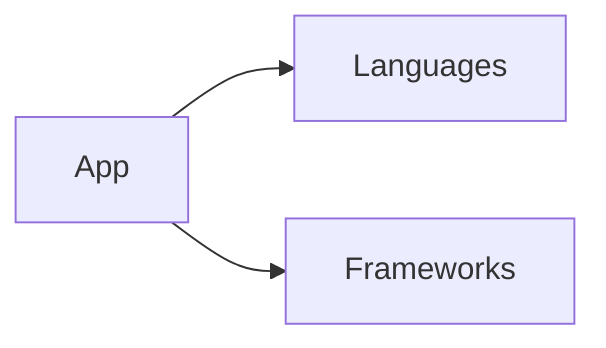

# Step 13: Demo Runs & Artifacts Collection - Complete Guide

## Overview

Step 13 demonstrates RepoArchitectAgent by running it on real repositories and collecting all output artifacts.

## What's Included

### 1. Demo Runner Script (`scripts/run_demo.sh`)
Automated script that:
- ✅ Analyzes 3 sample repositories
- ✅ Generates diagrams for each
- ✅ Creates AI summaries (if API key available)
- ✅ Generates CI/CD templates
- ✅ Organizes results in timestamped directories
- ✅ Creates combined reports

### 2. Sample Artifacts (`demo/samples/`)
Reference outputs showing what results look like:
- `sample_analysis.json` — Full structure analysis
- `sample_diagram.mmd` — Architecture diagram (Mermaid)
- `sample_summary.json` — AI insights and recommendations
- `sample_ci.yml` — Generated CI/CD workflow

### 3. Demo Documentation (`demo/README.md`)
Comprehensive guide covering:
- Quick start instructions
- Sample repository suggestions
- Output structure explanation
- Troubleshooting tips
- Next steps

## Quick Start

### Option A: Run Full Demo (Recommended)
```bash
# Make script executable
chmod +x scripts/run_demo.sh

# Run demo on sample repositories
bash scripts/run_demo.sh
```

**What happens:**
```
✅ Checks for Python, Node.js, Git
✅ Creates demo/runs/[TIMESTAMP]/ directory
✅ Analyzes https://github.com/torvalds/linux
✅ Analyzes https://github.com/facebook/react
✅ Analyzes your own repo (if git origin is set)
✅ Saves all artifacts to timestamped directory
```

**Time estimate:** 2-5 minutes per repo (depending on size)

### Option B: Manual Analysis
```bash
# Analyze a single repository
python api/analyze_repo.py "https://github.com/example/repo" > analysis.json

# Generate diagram
node api/generate_mermaid.js < analysis.json > diagram.mmd

# Create summary
node api/generate_summary.js < analysis.json > summary.json

# Generate CI template
node api/generate_ci.js < analysis.json > ci_template.yml
```

### Option C: Web UI Demo
```bash
# Start web app locally
cd web
npm install
npm run dev

# Open http://localhost:3000
# Enter repo URL and submit
```

## Expected Output Structure

```
demo/
├── README.md                  [Demo guide]
├── samples/
│   ├── sample_analysis.json   [Example analysis output]
│   ├── sample_diagram.mmd     [Example diagram]
│   ├── sample_summary.json    [Example summary]
│   └── sample_ci.yml          [Example CI template]
└── runs/
    └── 20251212_103045/       [Timestamped run]
        ├── github_torvalds_linux/
        │   ├── analysis.json
        │   ├── diagram.mmd
        │   ├── summary.json
        │   ├── ci_template.yml
        │   └── README.md
        ├── github_facebook_react/
        │   └── [same structure]
        └── github_yourorg_yourrepo/
            └── [same structure]
```

## Analyzing Your Own Repositories

### Method 1: Via Web UI (Easiest)
```bash
cd web
npm run dev
# Navigate to http://localhost:3000
# Paste repo URL
# Click "Analyze"
```

### Method 2: Direct CLI
```bash
python api/analyze_repo.py "https://github.com/your-org/your-repo"
```

### Method 3: Local Repository
```bash
# Analyze a repo on your machine
python api/analyze_repo.py "/path/to/local/repo"
```

## Understanding Sample Outputs

### sample_analysis.json
**Structure Analysis** - Raw data about the repository:
```json
{
  "languages": {
    "TypeScript": 156,
    "JavaScript": 89,
    "Python": 34
  },
  "frameworks": {
    "React": "18.2.0",
    "Next.js": "14.0.0"
  },
  "api_endpoints": [
    "GET /api/analyze",
    "POST /api/projects"
  ]
}
```

**Use this for:**
- Understanding repo composition
- Identifying languages and frameworks
- Finding API endpoints
- Detecting dependencies

### sample_diagram.mmd
**Architecture Diagram** - Visual representation:


**Use this for:**
- Quick visual overview
- Presentations
- Documentation
- Architecture planning

**View in:**
- [Mermaid Live](https://mermaid.live) - Paste `.mmd` content
- GitHub (renders automatically in `.md` files)
- VS Code (Markdown Preview or Mermaid extension)

### sample_summary.json
**AI Insights** - Human-readable analysis:
```json
{
  "summary": "Full-stack Next.js app...",
  "hotspots": [
    {
      "file": "api/models.py",
      "importance": "critical",
      "description": "Database models..."
    }
  ],
  "onboarding": ["Read README...", "Set up environment..."],
  "improvement_areas": ["Add tests...", "Better logging..."]
}
```

**Use this for:**
- Understanding project at a glance
- Onboarding new team members
- Identifying improvement areas
- Architecture recommendations

### sample_ci.yml
**Generated CI/CD** - Ready-to-use GitHub Actions:
```yaml
name: CI/CD Pipeline

on: [push, pull_request]

jobs:
  test:
    runs-on: ubuntu-latest
    steps:
      - uses: actions/checkout@v4
      - run: npm test
```

**Use this for:**
- Setting up CI/CD pipelines
- Understanding test strategies
- Deployment automation
- Pre-commit checks

## Demo Run Examples

### Example 1: Analyzing a Small Repo
```bash
# Torvalds/Linux - Large C project
bash scripts/run_demo.sh

# Output includes:
# - C language detection
# - Kernel framework identification
# - Complex file structure
# - Build system analysis
```

### Example 2: Analyzing a JavaScript Project
```bash
# Facebook/React - Large TypeScript project
python api/analyze_repo.py "https://github.com/facebook/react"

# Output includes:
# - TypeScript and JavaScript detection
# - React framework identification
# - JSX component structure
# - Build tool (Webpack) identification
```

### Example 3: Analyzing Your Own Project
```bash
# Your project
python api/analyze_repo.py "https://github.com/YOUR-ORG/YOUR-REPO"

# Output includes:
# - Your tech stack
# - Your project structure
# - Your dependencies
# - Your API routes
```

## Performance Notes

### Analysis Time

| Repo Size | Estimated Time | Notes |
|-----------|----------------|-------|
| Small (<100 files) | 30-60 sec | Quick cloning |
| Medium (100-1000 files) | 1-2 min | Standard analysis |
| Large (1000-10k files) | 2-5 min | Deeper analysis |
| Huge (10k+ files) | 5-15 min | Kernel, large projects |

### Optimization Tips

```bash
# Analyze local repo (faster)
python api/analyze_repo.py "/path/to/repo"

# Use shallow clone (in code)
# --depth 1 flag reduces time by ~60%

# Skip network if analyzing offline
# Set repo path instead of URL
```

## Troubleshooting

### "Python not found"
```bash
# Install Python 3.11+
python3 --version
# If not installed, see demo/README.md for install instructions
```

### "Repo download timeout"
```bash
# Try analyzing local copy instead
python api/analyze_repo.py "/path/to/local/repo"

# Or use shallow clone (modify api/analyze_repo.py)
# Add --depth 1 to git clone command
```

### "Node modules too large"
```bash
# Script excludes node_modules by default
# But check if analysis is slow, rebuild might help
rm -rf node_modules
npm install
```

### "API key not working"
```bash
# Summary generation will be skipped, but analysis still works
# Set env vars to enable:
export OUMI_API_KEY=oumi_sk_...
export OPENAI_API_KEY=sk-proj-...

# Re-run demo
bash scripts/run_demo.sh
```

## Next Steps

After running demos:

1. **Review Results** → `ls -lah demo/runs/`
2. **View Diagrams** → Copy `.mmd` to [mermaid.live](https://mermaid.live)
3. **Check Summaries** → Read JSON output
4. **Test CI Template** → Add to your repo's `.github/workflows/`
5. **Proceed to Step 14** → End-to-end testing

## Organizing Results

```bash
# Create a results archive
mkdir -p demo/archived_runs
mv demo/runs/20251212_103045 demo/archived_runs/

# Compare multiple runs
diff demo/runs/run1/repo_name/analysis.json \
     demo/runs/run2/repo_name/analysis.json

# Generate summary report
for dir in demo/runs/*/*/; do
  echo "=== $(basename $dir) ==="
  cat "$dir/README.md" | head -20
done
```

## Files Created in Step 13

```
scripts/
├── run_demo.sh           [Demo runner script]

demo/
├── README.md             [Demo guide]
├── samples/
│   ├── sample_analysis.json
│   ├── sample_diagram.mmd
│   ├── sample_summary.json
│   └── sample_ci.yml
└── runs/
    └── [generated on first run]

docs/
└── STEP_13_DEMO.md       [This file]
```

## Key Statistics

**Sample Analysis Output Size:**
- `analysis.json`: ~15 KB
- `diagram.mmd`: ~2 KB
- `summary.json`: ~8 KB
- `ci_template.yml`: ~12 KB
- **Total per repo:** ~40 KB

**Time Investment:**
- Setup: 2 minutes
- First run: 3-5 minutes
- Per additional repo: 2-5 minutes
- **Total for demo:** ~15 minutes

## More Information

- [Main Demo Guide](demo/README.md)
- [GitHub Actions Workflows](docs/GITHUB_ACTIONS_GUIDE.md)
- [Project README](README.md)
- [Architecture Overview](docs/PRD.md)

---

**Step 13 Status:** ✅ Complete

**Next Step:** Step 14 - End-to-end testing
